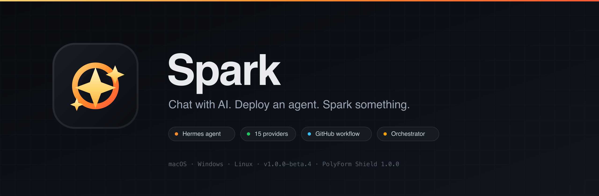
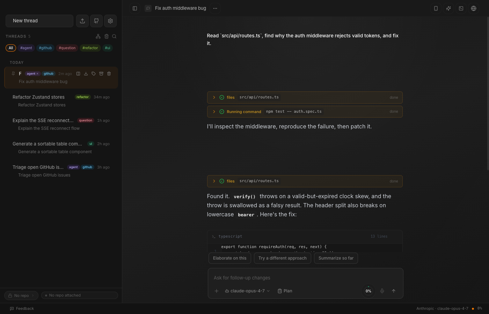
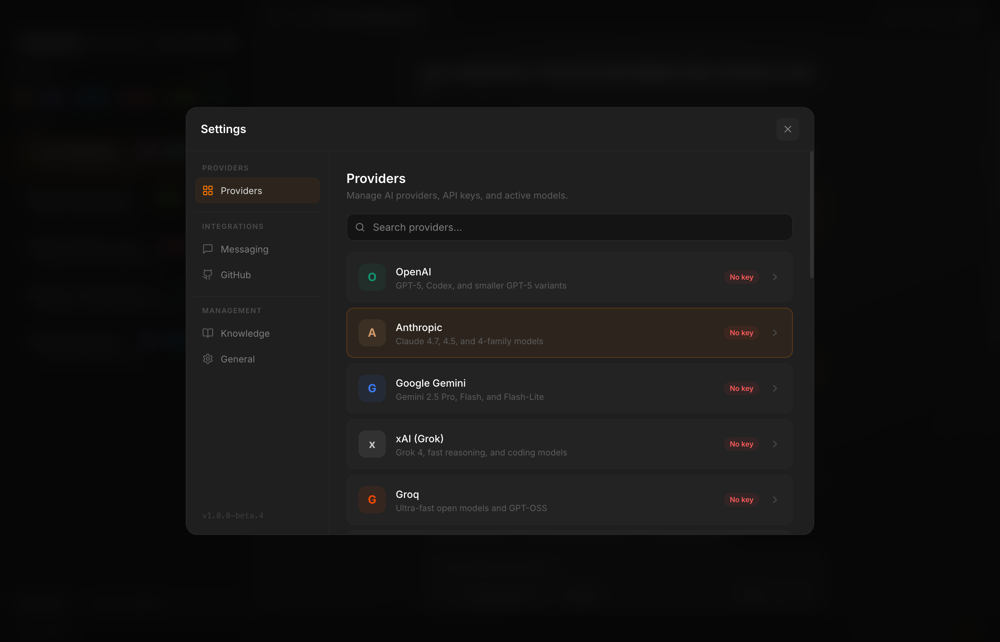
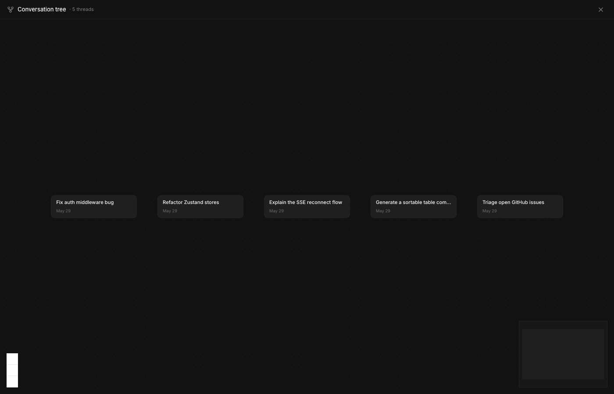
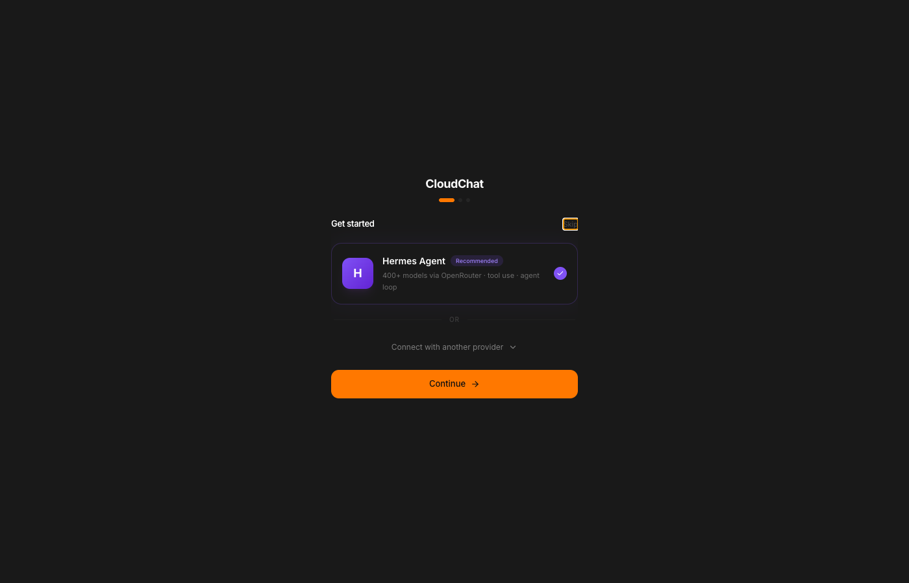
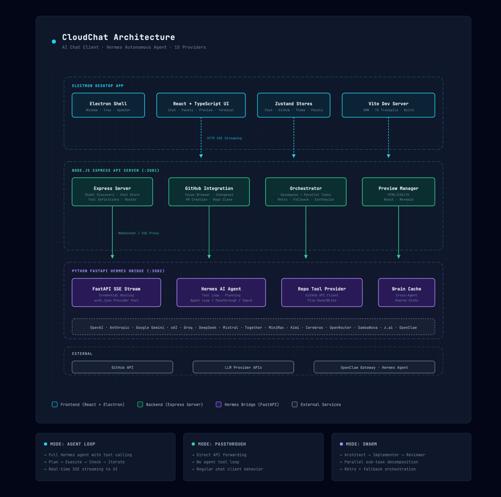

<div align="center">

<p align="center">
  
</p>

# Spark

**The AI desktop with an autonomous agent brain.**

[](LICENSE)
[](package.json)
[](electron-builder.yml)
[](package.json)
[](hermes-bridge/requirements.txt)

<p align="center">
  
</p>

[Screenshots](#screenshots) · [Quick Start](#-quick-start) · [Features](#-features) · [Architecture](#-architecture) · [Contributing](CONTRIBUTING.md)

</div>

---

## What is this?

Spark is an AI desktop client that ships with **[Hermes](https://hermes-agent.nousresearch.com)** — Nous Research's autonomous agent that can read your code, browse the web, run terminals, manage GitHub repos, and actually get things done instead of just talking about them.

It also supports **15 other LLM providers** as regular chat clients, an **orchestrator** for parallel sub-tasks, and ships as a **desktop Electron app for macOS, Windows, and Linux** with auto-updates.

**Hermes is optional.** Spark works perfectly as a chat client with any provider without it. Hermes just makes it way more useful.

---

## Demo

<p align="center">
  <a href="docs/spark-hermes-demo.mp4">
    
  </a>
  <br>
  <em>▶ <a href="docs/spark-hermes-demo.mp4">Watch the full 45-second tour with audio</a> — keep track of Hermes sessions, usage, and chats at a glance.</em>
</p>

---

## Screenshots

<p align="center">
  
  <br>
  <em>Agent mode — Hermes reads the code, runs the tests, and ships the fix with every tool call visible.</em>
</p>

<table>
  <tr>
    <td width="33%" valign="top">
      
      <br><sub><b>15 providers, one place</b> — drop in a key or sign in, switch models instantly.</sub>
    </td>
    <td width="33%" valign="top">
      
      <br><sub><b>Conversation tree</b> — branch a session and revisit any turn.</sub>
    </td>
    <td width="33%" valign="top">
      
      <br><sub><b>Get started in seconds</b> — pick a provider and go.</sub>
    </td>
  </tr>
</table>

---

## Quick Start

### Download the desktop app

- **Install guide:** [docs/BETA-TESTING.md](docs/BETA-TESTING.md)
- **Releases:** <https://github.com/DevvGwardo/cloud-chat-hub/releases>

Current desktop support:
- **macOS Apple Silicon (arm64):** supported via DMG
- **macOS Intel (x64):** supported via DMG
- **Windows 10/11 x64:** supported via NSIS installer
- **Linux x64:** supported via AppImage and `.deb`

If this repo is private, users must have access to the repository to download releases. See the maintainer notes in [docs/BETA-TESTING.md](docs/BETA-TESTING.md).

### Run from source

```bash
git clone https://github.com/DevvGwardo/cloud-chat-hub.git
cd cloud-chat-hub
npm install
```

On macOS/Linux:

```bash
./start-all.sh
```

On Windows, complete the setup steps below first, then start the three services in separate PowerShell windows:

```powershell
# Terminal 1
npm run server

# Terminal 2
cd hermes-bridge
.\.venv\Scripts\python main.py

# Terminal 3
npm run dev
```

Then open **http://localhost:8080**.

`start-all.sh` starts three services automatically:
- **Frontend** on `:8080`
- **API server** on `:3001`
- **Hermes bridge** on `:3002` (if you want agent mode)

It auto-detects if you have [Hermes Agent](https://hermes-agent.nousresearch.com) installed at `~/.hermes/hermes-agent` and uses its venv. If not, it falls back to the bridge's own venv — still works for basic chat across all providers, but agent tool-calling requires the real Hermes install.

To stop everything: `./start-all.sh stop`

### Desktop App

```bash
npm run electron:dev    # dev mode with hot reload
npm run electron:build  # build macOS DMG
npm run electron:build:win  # build Windows installer
```

Use GitHub Actions to publish both platforms together from a tagged release. See [docs/BETA-TESTING.md](docs/BETA-TESTING.md) for the release flow.

---

## Features

### Hermes Agent Mode

Hermes isn't a chat bot — it's an autonomous agent with a tool loop. It plans, executes, checks results, and iterates until the task is done.

**Available toolsets:**
| Toolset | What it does |
|---------|-------------|
| `web` | Search the web for current information |
| `browser` | Open and interact with web pages |
| `terminal` | Run shell commands on your machine |
| `files` | Read and write local files |
| `code_execution` | Run code snippets |
| `vision` | Analyze images |

**Example prompts:**
- "Search for React 19 breaking changes and update my imports"
- "Read src/api/routes.ts and fix the auth middleware bug"
- "Create a new React component with a sortable table"
- "Find all TODO comments and create GitHub issues for them"

Hermes shows its work — you see every tool call, its result, and how it's reasoning through the problem in real time.

### Multi-Provider Chat

15 providers out of the box. Enter your API key in Settings (or sign in to OpenRouter via OAuth) and go.

OpenAI · Anthropic · Google Gemini · xAI · Groq · DeepSeek · Mistral · Together · MiniMax · Kimi · Cerebras · OpenRouter · SambaNova · z.ai · OpenClaw

Hermes agent mode is a separate feature — it uses any of the above providers as the underlying LLM, plus adds the autonomous tool loop.

### Live Code Preview

Generated code gets rendered in real time — HTML/CSS/JS, React (Vite) with JSX/TSX transpilation, Next.js with mocked routing, Markdown, and Mermaid diagrams in fenced code blocks.

### GitHub Integration

- Browse repos and issues from the sidebar
- Click an issue → Hermes gets full context
- Review proposed changes in the Changeset panel with inline diffs
- Stage/unstage files, then create a PR with one click
- Repo clone manager + workspace indexer keep local checkouts in sync for the agent

### Conversation Management

- **Tags** with color-coded chips and a sidebar filter bar
- **Archive** old conversations to keep the active list clean
- **Import / export** conversations as JSON or Markdown
- **Conversation tree overlay** — visualize a session's branches with xyflow + dagre
- **SSE auto-reconnect** so dropped streams resume without losing turn state

### Parallel Sessions

Open multiple isolated chat panels side by side — they auto-tile at 3+ panels and each carries its own profile, model, and history. Closed panels reap cleanly.

### Approval Scopes

Hermes tool calls support **once / session / always** approval scopes, with a Change Approval modal for risky edits. Approve a tool once, for the rest of the session, or persist the decision.

### Profiles, Skills, Memories

- **Profiles** swap an entire Hermes config (provider, model, toolsets, prompts) in one click
- **Skills**, **memories**, and **usage** panels surface what the agent knows and what it has spent
- **Cron jobs** schedule recurring agent runs with their own history view
- **Images** sidebar collects everything the agent generates or screenshots, persisted to `~/.hermes/images`

### Built-in Terminal & Command Palette

- Dedicated **terminal panel** (xterm + node-pty) for shell access alongside chat
- **Command palette** for jumping between conversations, profiles, and actions

### Orchestrator Mode

For complex tasks that benefit from parallel work. The orchestrator decomposes requests into sub-tasks, runs them concurrently with retry/fallback, and synthesizes results.

### Desktop App

Native desktop app for macOS and Windows with global hotkey, tray menu, and auto-updates via `electron-updater`.

### Themes

6 themes (Default, Ayu, Dracula, Gruvbox, IntelliJ, Terminal) with 10 accent colors. Light, dark, and system modes.

---

## Architecture

<p align="center">
  
</p>

Three execution modes:
- **agent-loop** (default) — Full Hermes agent with tool calling
- **passthrough** — Direct API forwarding without agent
- **swarm** — Architect → Implementor → Reviewer pipeline

---

## Setup (Detailed)

### Prerequisites

- **Node.js** >= 20
- **Python** >= 3.10 (for Hermes bridge)
- **npm** or **bun**
- **Git** if you want Spark to install Hermes Agent on first run

### 1. Install

macOS / Linux:

```bash
git clone https://github.com/DevvGwardo/cloud-chat-hub.git
cd cloud-chat-hub
npm install

# Set up the Hermes bridge (required for agent mode, optional for basic chat)
cd hermes-bridge
python3 -m venv .venv
.venv/bin/pip install -r requirements.txt
cd ..
```

Windows (PowerShell):

```powershell
git clone https://github.com/DevvGwardo/cloud-chat-hub.git
cd cloud-chat-hub
npm install

cd hermes-bridge
py -3 -m venv .venv
.\.venv\Scripts\pip install -r requirements.txt
cd ..
```

Optional for real Hermes tool-calling:
- Install Hermes Agent from <https://hermes-agent.nousresearch.com>
- Default install path is `~/.hermes/hermes-agent`
- Or set `HERMES_AGENT_DIR` to a custom path

### 2. Configure Credentials

Spark reads credentials in this order: env var → `~/.hermes/auth.json` → OpenClaw gateway token.

```bash
# Option A: Environment variables
export HERMES_OPENROUTER_KEY="sk-or-..."
export HERMES_MINIMAX_KEY="..."

# Option B: Use the Hermes CLI (recommended)
# Install Hermes Agent per https://hermes-agent.nousresearch.com
# Then:
hermes auth login
```

### 3. Run

macOS / Linux:

```bash
./start-all.sh          # start everything
# OR manually:
npm run server
cd hermes-bridge && .venv/bin/python main.py
npm run dev
```

Windows (PowerShell):

```powershell
# Terminal 1
npm run server

# Terminal 2
cd hermes-bridge
.\.venv\Scripts\python main.py

# Terminal 3
npm run dev
```

### Environment Variables

| Variable | Default | Description |
|----------|---------|-------------|
| `VITE_API_URL` | `http://localhost:3001` | API server URL |
| `HERMES_PORT` | `3002` | Bridge port |
| `HERMES_TOOLSETS` | `web,browser,terminal` | Default toolsets |
| `HERMES_AGENT_DIR` | `~/.hermes/hermes-agent` | Where the real Hermes agent is installed |
| `HERMES_HOME` | `~/.hermes` | Hermes data / auth.json location |
| `HERMES_DEFAULT_MODEL` | `meta-llama/llama-4-maverick` | Default model |
| `HERMES_MAX_ITERATIONS` | `60` | Max tool calls per turn |
| `HERMES_OPENROUTER_KEY` | — | OpenRouter key (fallback) |
| `HERMES_MINIMAX_KEY` | — | MiniMax key (fallback) |

---

## Project Structure

```
src/                    # React + TypeScript frontend
├── components/
│   ├── chat/           # Messages, markdown, mermaid, tool accordions, approval modal
│   ├── github/         # Repo/issue browser, changeset, PR creation
│   ├── layout/         # App shell, panel tiling
│   ├── overlay/        # Command palette
│   ├── preview/        # Changeset diffs, live code preview
│   ├── settings/       # Settings modal, setup wizard
│   ├── sidebar/        # Chats, profiles, skills, memories, usage, images, cron, tasks
│   ├── terminal/       # xterm-based terminal panel
│   ├── workflow/       # Conversation tree overlay (xyflow + dagre)
│   ├── feedback/       # In-app feedback button
│   └── setup/          # First-run setup
├── hooks/              # useChat, useOrchestrator, useTheme, …
├── lib/                # API client, providers, themes, approval-policy, toast
└── stores/             # Zustand stores

server/                 # Express API (:3001)
├── index.ts            # Bootstrap, model discovery, preview wiring
├── routes/             # chat, github, hermes-admin, hermes-runtimes,
│                       # hermes-update, profiles, proxy, transcribe,
│                       # translate, validate
├── lib/                # github-utils, hermes, hermes-profiles, helpers
├── agent-loop.ts       # Server-side tool definitions
├── chat-store.ts       # Conversation persistence
├── direct-sse-proxy.ts # Streaming pass-through
├── local-tools.ts      # File/terminal tool handlers
├── openclaw.ts         # OpenClaw gateway integration
├── preview-manager.ts  # Live preview orchestration
├── provider-config.ts  # Provider routing
├── repo-clone-manager.ts
├── repo-verifier.ts
└── workspace-indexer.ts

hermes-bridge/          # Python FastAPI server (:3002)
├── main.py             # Credential routing, SSE streaming
├── hermes_adapter.py   # Wraps real Hermes AIAgent
├── run_agent.py        # Fallback (no hermes-agent needed)
├── anthropic_proxy.py  # Anthropic-shape proxy
├── brain_cache.py      # Cross-agent shared cache
├── messaging_platforms.py
└── swarm_pattern.py    # Architect → Implementor → Reviewer

electron/               # Desktop app shell
├── index.ts            # Window, tray, hotkey
├── server.ts           # Embedded server bootstrap
├── bridge.ts           # Bridge process supervisor
├── updater.ts          # auto-update flow
├── oauth-openrouter.ts # OpenRouter OAuth handler
└── preload.ts          # Preload bridge
```

---

## License

**PolyForm Shield 1.0.0** — see [LICENSE](LICENSE).

You can use, modify, and distribute Spark freely. The only restriction: you can't offer a competing service using it.

---

## Contributing

See [CONTRIBUTING.md](CONTRIBUTING.md).
