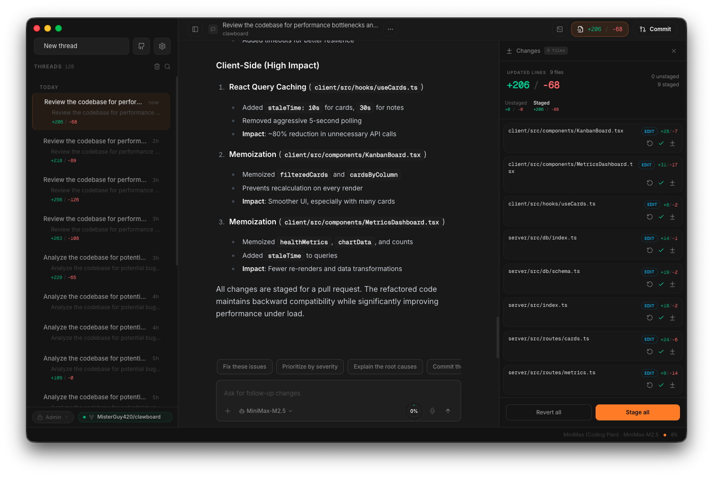
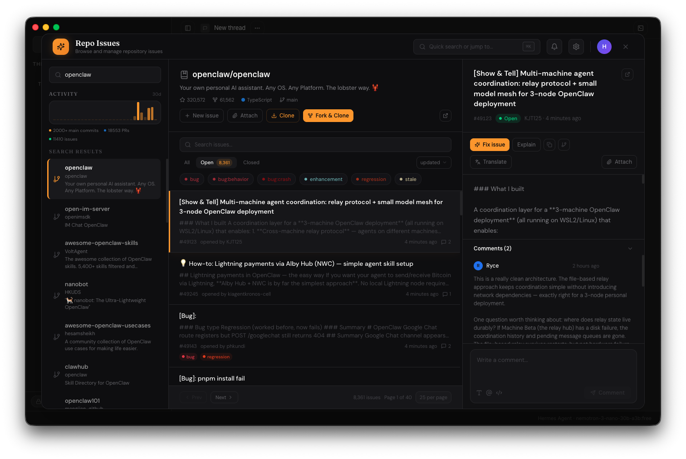

# CloudChat

AI chat client built around [Hermes](https://github.com/DevvGwardo/hermes-agent) — an autonomous AI agent with real tool access. Hermes can read and edit your code, browse the web, run terminals, and manage GitHub repos. CloudChat gives it a beautiful interface, multi-provider routing, and live code preview.

Also supports 16 other LLM providers, an orchestrator for parallel sub-tasks, and ships as a native macOS Electron app.




## What is Hermes?

Hermes is an autonomous AI agent that goes beyond chat. It has a tool loop — it can call functions, inspect results, and iterate until the task is done.

**What Hermes can do:**
- Read, edit, create, and delete files in GitHub repos
- Browse the web and interact with web pages
- Run terminal commands
- Execute code
- Search its own memory and skill library
- Manage multi-step tasks with a todo system

**The bridge:** CloudChat connects to Hermes through the **Hermes Bridge** — a Python FastAPI server that wraps the Hermes agent, provides GitHub repo tools, handles streaming, and manages credential routing across providers.

## Features

### Agent-First

- **Hermes Agent Mode** — Autonomous tool-calling agent with configurable toolsets: web search, browser, terminal, files, code execution, vision
- **GitHub Repo Tools** — Connect a repo and Hermes reads, edits, creates, deletes, and batch-edits files with full changeset staging and PR workflow
- **Multi-Provider Routing** — Hermes routes to OpenRouter, Nous, or MiniMax based on model and `~/.hermes/auth.json` credentials
- **Orchestrator Mode** — Decomposes complex requests into parallel sub-tasks, executes with retry and fallback models, synthesizes results
- **Brain MCP Integration** — Multi-agent coordination for parallel workstreams

### Chat Client

- **17 LLM Providers** — OpenAI, Anthropic, Google Gemini, xAI, Groq, DeepSeek, Mistral, Together, MiniMax, Kimi, Cerebras, OpenRouter, SambaNova, z.ai, OpenClaw, and Hermes Agent
- **Live Code Preview** — Real-time preview of generated code: HTML/CSS/JS, React (Vite) with JSX/TSX transpilation, Next.js with mocked routing, and Markdown
- **Changeset Panel** — Review proposed file changes with inline diffs, added/removed line counts, per-file staging, and revert
- **Streaming** — Real-time token streaming with context usage tracking
- **Themes** — 6 themes (Default, Ayu, Dracula, Gruvbox, IntelliJ, Terminal) with 10 accent colors, light/dark/system modes
- **Desktop App** — Native macOS Electron app with global hotkey (Cmd+Shift+Space), tray menu, and auto-updates

## How to Use

### Basic Chat

1. Open CloudChat (web or Electron app)
2. Pick a provider and model from the model selector in the chat bar
3. Type your message and hit Enter
4. That's it — standard AI chat with streaming responses

### Using Hermes Agent Mode

Hermes is what makes CloudChat different. It's not just a chat — it's an agent that can *do things*.

1. Select **Hermes Agent** as the provider in Settings
2. Pick a model (any model works — Hermes handles the tool loop regardless of provider)
3. Enable the toolsets you want:
   - **web** — Search the web for current information
   - **browser** — Open and interact with web pages
   - **terminal** — Run shell commands on your machine
   - **files** — Read and write local files
   - **code_execution** — Run code snippets
   - **vision** — Analyze images
4. Ask Hermes to do something — it will plan, use tools, and iterate until done

**Example prompts:**
- "Search for the latest React 19 changes and summarize them"
- "Read my package.json and tell me which dependencies are outdated"
- "Create a new React component that renders a sortable table"
- "Find and fix the bug in src/api/routes.ts"

Hermes shows its work — you'll see tool calls, their results, and how it's reasoning through the problem in real time.

### Working with GitHub Repos

1. Add a GitHub Personal Access Token in Settings → GitHub
2. Open the GitHub panel (sidebar icon)
3. Browse your repos and issues
4. Click an issue to start an issue-focused chat — Hermes gets the full context
5. Ask Hermes to make changes — it reads the repo, proposes edits, and stages them in the Changeset panel
6. Review changes with inline diffs in the Workspace sidebar
7. Stage/unstage individual files
8. Click **Create PR** to open a pull request with auto-generated title and description

**Tips:**
- Start with "read-only" prompts to let Hermes explore before making changes
- Use batch edits — "update all imports from old-api to new-api across these files"
- The Changeset panel shows exactly what changed before anything hits GitHub

### Orchestrator Mode

For complex tasks that benefit from parallel work:

1. Enable Orchestrator in Settings
2. Configure: planning model, code model, fallback model, max sub-agents
3. Send a complex request — the orchestrator breaks it into sub-tasks, runs them in parallel, and synthesizes the results

**Good for:** multi-file refactors, generating tests + implementation, researching multiple topics at once.

### Switching Providers

CloudChat supports 17 providers. To use any non-Hermes provider:

1. Open Settings → Providers
2. Enter your API key for the provider you want
3. Select it as active in the model selector

Your API keys stay in the browser — they never hit our servers.

## Getting Started

### 1. Start the API Server

```sh
git clone https://github.com/DevGwardo/cloud-chat-hub.git
cd cloud-chat-hub
npm install
npm run server    # Port 3001
```

### 2. Start the Hermes Bridge (Agent Mode)

```sh
cd hermes-bridge
pip install -r requirements.txt
python main.py    # Port 3002
```

Credentials are read from `~/.hermes/auth.json` (created by the [Hermes CLI](https://github.com/DevvGwardo/hermes-agent)). Run `hermes auth login` to configure providers.

**Model routing:**
- `MiniMax-*` models → MiniMax direct API
- `nousresearch/*` models or `active_provider: nous` → Nous inference API
- Everything else → OpenRouter

### 3. Start the Frontend

```sh
npm run dev
```

Select Hermes as the provider in Settings. Configure toolsets (web, browser, vision, terminal, files, code_execution) from there.

### Desktop App (Electron)

```sh
npm run electron:dev       # Dev mode with hot reload
npm run electron:build     # Build macOS app (DMG + ZIP)
npm run electron:publish   # Build and publish to GitHub Releases
```

## Environment Variables

| Variable | Default | Description |
|----------|---------|-------------|
| `VITE_API_URL` | `http://localhost:3001` | URL of the API server |
| `HERMES_PORT` | `3002` | Hermes Bridge server port |
| `HERMES_TOOLSETS` | `web,browser,vision` | Default agent toolsets |
| `HERMES_DEFAULT_MODEL` | `meta-llama/llama-4-maverick` | Default Hermes model |
| `HERMES_MAX_ITERATIONS` | `60` | Max tool-use iterations per turn |
| `HERMES_OPENROUTER_KEY` | — | OpenRouter API key (fallback if auth.json missing) |
| `HERMES_MINIMAX_KEY` | — | MiniMax API key (fallback if auth.json missing) |
| `ORCHESTRATOR_SUBTASK_TIMEOUT_MS` | `5400000` | Per-subtask timeout for orchestrator |
| `OPENCLAW_BIN` | `~/.openclaw/bin/openclaw` | Path to OpenClaw CLI |

API keys are resolved in order: env var → `~/.hermes/auth.json` credential pool → OpenClaw gateway token.

## GitHub Integration

1. **Connect** — Add a GitHub PAT in Settings
2. **Browse Issues** — Filter, sort, jump into issue-focused chats
3. **Propose Changes** — Hermes proposes file changes via server-side repo tools. Review in the Workspace panel
4. **Stage & Review** — Stage/unstage files, view inline diffs with line counts, revert changes
5. **Create PR** — Open a pull request with auto-generated branch, title, and description. Supports draft PRs
6. **Monitor & Merge** — Track CI checks, then merge (squash, rebase, or merge commit)

## Hermes Bridge Architecture

```
CloudChat UI  →  Express Server (port 3001)  →  Hermes Bridge (port 3002)
                      │                                │
                      ├─ Chat proxy                    ├─ FastAPI SSE streaming
                      ├─ GitHub integration            ├─ Hermes AIAgent (tool loop)
                      ├─ Orchestrator                  ├─ RepoToolProvider (GitHub API)
                      └─ Preview manager               └─ Credential routing (auth.json)
```

The bridge supports three execution modes:
- **agent-loop** (default) — Full Hermes agent with tool calling
- **passthrough** — Direct API forwarding without agent
- **swarm** — Architect → Implementor → Reviewer pipeline

## Project Structure

```
src/
├── components/
│   ├── chat/          # Chat UI, messages, markdown renderer, activity indicators
│   ├── github/        # GitHub panel, issue browser, PR creation
│   ├── layout/        # App shell layout
│   ├── preview/       # Workspace sidebar (changeset diffs, live code preview)
│   ├── settings/      # Settings modal, setup wizard, knowledge panel
│   ├── sidebar/       # Chat history sidebar
│   └── terminal/      # Terminal panel
├── hooks/             # useChat, useOrchestrator, useTheme
├── lib/               # API client, providers, tokens, themes, repo tools
├── stores/            # Zustand stores (chat, settings, changeset, orchestrator, etc.)
└── contexts/          # React contexts (PanelContext)
server/
├── index.ts           # Express API — chat, GitHub, preview, model discovery
├── agent-loop.ts      # Server-side agentic tool definitions and execution
├── direct-sse-proxy.ts # SSE proxy for compatible providers (MiniMax, Kimi)
├── orchestrator.ts    # Multi-agent orchestrator with planning, execution, synthesis
├── provider-config.ts # Provider routing, model lists, headers
├── chat-store.ts      # Server-side chat persistence
├── preview-manager.ts # Project preview lifecycle (clone, build, serve)
└── openclaw.ts        # OpenClaw CLI integration
hermes-bridge/
├── main.py            # FastAPI server — credential routing, SSE streaming, brain MCP
├── hermes_adapter.py  # Wraps real Hermes AIAgent for CloudChat
├── run_agent.py       # Fallback AIAgent (when hermes-agent not installed)
└── requirements.txt   # Python dependencies
electron/
├── index.ts           # Main process (window, tray, hotkey, auto-update)
├── preload.ts         # Preload bridge (API port, theme, window controls)
└── updater.ts         # Auto-update logic
```

## Scripts

| Command | Description |
|---------|-------------|
| `npm run dev` | Start frontend dev server |
| `npm run server` | Start API server (port 3001) |
| `npm run build` | Production build |
| `npm run test` | Run tests |
| `npm run lint` | Lint with ESLint |
| `npm run typecheck` | Type-check frontend and Electron |
| `npm run electron:dev` | Electron dev mode with hot reload |
| `npm run electron:build` | Build macOS desktop app |
| `npm run electron:publish` | Build and publish to GitHub Releases |

## License

Licensed under the **Business Source License 1.1** (BSL 1.1).
